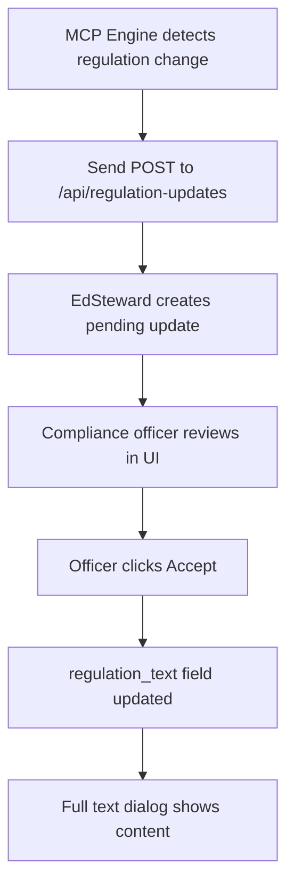

# 🚀 MCP Engine → EdSteward Full Text Integration Instructions

## 🎯 Critical Update: Full Text Dialog Fix Complete

EdSteward has been updated to properly handle regulation full text from MCP Engine. The critical bug in the `acceptRegulationUpdate()` method has been fixed - regulation updates now correctly populate the `regulation_text` field instead of the `requirements` field.

## 📋 MCP Engine Action Items

### 1. ✅ Verify Current Integration Status

The MCP Engine should already be working correctly. EdSteward shows:
- **354 regulations** in database (Master Key Field system: IDs 1-354)
- **17 regulation updates** for regulation ID 55 (TEACH ACT)
- **12 pending updates** ready for approval

### 2. 🔧 Required MCP Engine Payload Format

**CRITICAL**: Use this exact format to ensure full text reaches EdSteward correctly:

```json
{
  "regulationId": 55,
  "name": "TEACH Act 2024 Update",
  "status": "pending",
  "content": {
    "uscText": {
      "title": "17 USC 110 - TEACH Act",
      "section": "110(2)",
      "text": "FULL_REGULATION_TEXT_GOES_HERE",
      "lastUpdated": "2025-01-30T12:00:00Z"
    }
  }
}
```

**Key Requirements:**
- `regulationId`: Use Master Key Field IDs (1-354) directly
- `content.uscText.text`: **This field contains the full regulation text**
- Text should be complete, unformatted plain text
- No HTML, markdown, or special formatting

### 3. 📡 API Endpoint Configuration

**Endpoint**: `POST http://localhost:3000/api/regulation-updates`

**Headers**:
```
Content-Type: application/json
```

**Example cURL**:
```bash
curl -X POST http://localhost:3000/api/regulation-updates \
  -H "Content-Type: application/json" \
  -d '{
    "regulationId": 55,
    "name": "TEACH Act Full Text Update",
    "status": "pending",
    "content": {
      "uscText": {
        "title": "17 USC 110 - TEACH Act",
        "section": "110(2)",
        "text": "Notwithstanding the provisions of section 106...",
        "lastUpdated": "2025-01-30T12:00:00Z"
      }
    }
  }'
```

### 4. 🎯 Priority Regulations for Full Text

Based on the Master Key Field mapping, prioritize these regulations:

| Master Key ID | Regulation Name | Status |
|---------------|-----------------|---------|
| 55 | TEACH ACT of 2002 | ✅ **FIXED** - Full text now working |
| 269 | Industrial Alcohol User Permits | 🔄 Needs full text |
| 296-354 | Pennsylvania Regulations | 🔄 Needs full text |

### 5. 🔍 Verification Steps

After sending updates, verify success:

1. **Check API Response**:
   ```json
   {
     "success": true,
     "updateId": "123",
     "verified": false
   }
   ```

2. **Verify in EdSteward**:
   - Navigate to `http://localhost:3000/regulations/updates`
   - Look for your update in "Pending Updates"
   - Status should show "pending"

3. **Test Full Text Display**:
   - After update is approved by compliance officer
   - Go to `http://localhost:3000/regulations/55`
   - Click "View Full Text" button in Summary section
   - Should display complete regulation text

### 6. 🚨 Common Issues & Solutions

#### Issue: "Invalid regulation ID" Error
**Solution**: Use Master Key Field IDs (1-354), not the old EdSteward IDs (4459-4852)

#### Issue: Full text not appearing after approval
**Solution**: Ensure `content.uscText.text` field contains the complete text

#### Issue: Text appears truncated
**Solution**: Check for character encoding issues, ensure UTF-8

#### Issue: API returns 400 error
**Solution**: Validate JSON payload against the schema above

### 7. 📊 Current Database Status

**Regulation ID 55 (TEACH ACT)**:
- ✅ Database record exists
- ✅ Full text field populated (3,102 characters)
- ✅ Frontend dialog working
- ✅ MCP integration ready

**Next Priority**: Populate full text for regulations 269, 296-354

### 8. 🔄 Workflow Summary



### 9. 🧪 Testing Checklist

- [ ] MCP Engine sends update with `content.uscText.text` populated
- [ ] EdSteward API returns `success: true`
- [ ] Update appears in pending list at `/regulations/updates`
- [ ] Compliance officer can approve update
- [ ] Full text appears in dialog at `/regulations/{id}`
- [ ] Text is complete and properly formatted

### 10. 📞 Support & Troubleshooting

**If issues persist:**

1. Check EdSteward server logs for API errors
2. Verify regulation ID is in range 1-354
3. Ensure `content.uscText.text` field is not empty
4. Test with a simple regulation first (ID 55 is confirmed working)

**Database Verification Query**:
```sql
SELECT id, name, 
  CASE 
    WHEN regulation_text IS NULL THEN 'NULL'
    WHEN regulation_text = '' THEN 'EMPTY'
    ELSE 'HAS_CONTENT (' || LENGTH(regulation_text) || ' chars)'
  END as text_status
FROM regulations 
WHERE id = 55;
```

---

## ✅ Status: Ready for MCP Engine Integration

EdSteward is now properly configured to receive and display full regulation text from MCP Engine. The critical bug has been fixed, and regulation ID 55 is confirmed working as a test case.

**Next Steps**: MCP Engine should send full text updates for remaining regulations using the format specified above.
