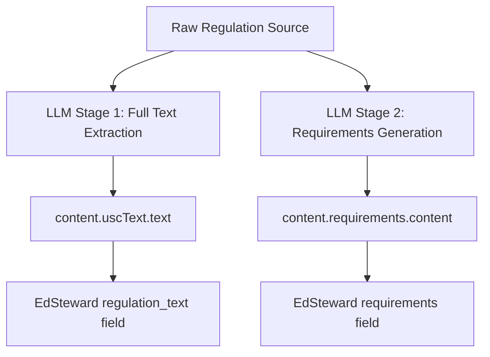

# 🤖 MCP Engine LLM Stage 2 Implementation Guide

## 🎯 Current Status

**EdSteward Side**: ✅ **READY** - API updated to handle requirements field separately from full text
**MCP Engine Side**: ❌ **NEEDS IMPLEMENTATION** - LLM Stage 2 requirements generation not yet implemented

## 🚨 Critical Issue Identified

The `requirements` field in EdSteward regulations currently contains:
- **Regulation 55 (TEACH ACT)**: Full regulation text (3,102 chars) ❌ 
- **Other regulations**: Generic placeholder text ❌

**Root Cause**: MCP Engine is only implementing **LLM Stage 1** (full text extraction) but not **LLM Stage 2** (requirements generation).

---

## 🔧 MCP Engine Implementation Required

### 1. **Two-Stage LLM Architecture**



### 2. **LLM Stage 2 Prompt Template**

```
SYSTEM: You are a compliance expert specializing in higher education regulations. Generate structured, actionable compliance requirements from regulation text.

USER: Analyze this regulation and generate specific compliance requirements for higher education institutions:

[FULL_REGULATION_TEXT]

Generate requirements in this exact format:

**Key Compliance Requirements:**

1. **[Requirement Category]**
   - [Specific actionable requirement]
   - [Implementation deadline/frequency if applicable]
   - [Responsible party/department]

2. **[Next Category]**
   - [Specific actionable requirement]
   - [Implementation details]

**Documentation Requirements:**
- [Required records/documentation]
- [Retention periods]

**Reporting Requirements:**
- [Required reports/submissions]
- [Submission deadlines]
- [Recipient agencies]

**Training Requirements:**
- [Required training programs]
- [Target audiences]
- [Frequency]

**Monitoring & Compliance:**
- [Ongoing monitoring activities]
- [Compliance verification methods]
- [Audit requirements]

Focus on actionable, specific requirements that compliance officers can implement. Avoid generic statements.
```

### 3. **Updated MCP Engine Workflow**

```javascript
async function processRegulation(regulationId, rawRegulationData) {
  console.log(`🔄 Processing regulation ${regulationId} with LLM Stage 1 & 2...`);
  
  // Stage 1: Extract full text (EXISTING)
  const fullText = await extractFullText(rawRegulationData);
  
  // Stage 2: Generate requirements (NEW - IMPLEMENT THIS)
  const requirements = await generateRequirements(fullText);
  
  // Send both to EdSteward
  const payload = {
    regulationId: regulationId,
    name: `${getRegulationName(regulationId)} - Complete Update`,
    status: "pending",
    content: {
      uscText: {
        title: getRegulationTitle(regulationId),
        section: getRegulationSection(regulationId),
        text: fullText, // Stage 1 output
        lastUpdated: new Date().toISOString()
      },
      requirements: {
        generated: true,
        llmModel: "gpt-4", // or whatever model you're using
        generatedAt: new Date().toISOString(),
        content: requirements // Stage 2 output
      }
    }
  };
  
  await sendToEdSteward(payload);
}

// NEW FUNCTION TO IMPLEMENT
async function generateRequirements(fullText) {
  const prompt = `
SYSTEM: You are a compliance expert specializing in higher education regulations. Generate structured, actionable compliance requirements from regulation text.

USER: Analyze this regulation and generate specific compliance requirements for higher education institutions:

${fullText}

Generate requirements in this exact format:

**Key Compliance Requirements:**

1. **[Requirement Category]**
   - [Specific actionable requirement]
   - [Implementation deadline/frequency if applicable]
   - [Responsible party/department]

[... rest of template ...]
`;

  const response = await callLLM(prompt);
  return response.trim();
}
```

### 4. **Priority Implementation Order**

#### **Phase 1: Test with TEACH ACT (Regulation 55)**
```javascript
// Test implementation with known regulation
const teachActRequirements = await generateRequirements(teachActFullText);

const testPayload = {
  regulationId: 55,
  name: "TEACH ACT - LLM Stage 2 Test",
  status: "pending",
  content: {
    uscText: {
      title: "17 USC 110 - TEACH Act",
      section: "110(2)",
      text: teachActFullText,
      lastUpdated: "2025-01-30T12:00:00Z"
    },
    requirements: {
      generated: true,
      llmModel: "gpt-4",
      generatedAt: "2025-01-30T12:00:00Z",
      content: teachActRequirements
    }
  }
};
```

#### **Phase 2: Implement for Top 10 Regulations**
- Regulation 55: TEACH ACT ✅ (test case)
- Regulation 269: Industrial Alcohol User Permits
- Regulations 1-10: Core higher education regulations

#### **Phase 3: Full Rollout (354 Regulations)**
- Implement batch processing
- Add quality validation
- Monitor LLM costs and performance

### 5. **Expected Requirements Output Example**

For **TEACH ACT (Regulation 55)**:

```
**Key Compliance Requirements:**

1. **Copyright Compliance for Digital Learning**
   - Implement technological measures to prevent unauthorized retention and distribution of copyrighted materials
   - Limit access to enrolled students for specific course sessions
   - Ensure materials are directly related to teaching content

2. **Faculty Training and Authorization**
   - Train faculty on TEACH Act limitations and requirements
   - Establish approval process for copyrighted material use in online courses
   - Document faculty acknowledgment of copyright responsibilities

**Documentation Requirements:**
- Maintain records of copyrighted materials used in courses
- Document technological protection measures implemented
- Retain course enrollment records for access verification

**Reporting Requirements:**
- No specific federal reporting required
- Internal compliance audits recommended annually

**Training Requirements:**
- Annual copyright training for all faculty using digital materials
- New faculty orientation on TEACH Act compliance
- IT staff training on technological protection measures

**Monitoring & Compliance:**
- Regular audits of online course materials
- Monitor technological protection measure effectiveness
- Review and update policies annually
```

### 6. **Quality Validation Checklist**

Generated requirements must:
- ✅ Be specific and actionable (not generic)
- ✅ Include implementation details where applicable
- ✅ Specify responsible parties/departments
- ✅ Include deadlines, frequencies, and timelines
- ✅ Cover documentation and reporting requirements
- ✅ Be relevant to higher education institutions
- ✅ Avoid legal jargon, use plain language
- ✅ Be structured consistently across regulations

### 7. **Testing & Validation Process**

1. **Generate requirements** for regulation 55 using LLM Stage 2
2. **Send complete payload** to EdSteward with both full text and requirements
3. **Verify in EdSteward**:
   - Navigate to `http://localhost:3000/regulations/updates`
   - Look for the update with both full text and requirements
   - Accept the update
   - Check `http://localhost:3000/regulations/55`:
     - "View Full Text" button shows complete regulation text
     - Requirements section shows structured compliance requirements
     - **Verify they are different content**

### 8. **API Endpoint Confirmation**

**Endpoint**: `POST http://localhost:3000/api/regulation-updates`

**Expected Response**:
```json
{
  "success": true,
  "updateId": "123",
  "verified": false
}
```

---

## 🚀 MCP Engine Action Items

### **Immediate (This Week)**
- [ ] Implement `generateRequirements()` function with LLM Stage 2
- [ ] Test with TEACH ACT (regulation 55)
- [ ] Verify both full text and requirements are sent correctly
- [ ] Confirm EdSteward receives and stores both fields separately

### **Short Term (Next Week)**
- [ ] Implement for top 10 regulations
- [ ] Add quality validation scoring
- [ ] Monitor LLM costs and performance

### **Medium Term (Next Month)**
- [ ] Full rollout to all 354 regulations
- [ ] Implement batch processing
- [ ] Add error handling and retry logic

---

## ✅ Success Criteria

- **Separation**: Full text and requirements are distinct in EdSteward
- **Quality**: Requirements are actionable and specific to higher education
- **Coverage**: All regulations have both full text AND requirements
- **Usability**: Compliance officers can implement the generated requirements
- **Accuracy**: Requirements align with actual legal obligations

**The EdSteward API is ready - MCP Engine needs to implement LLM Stage 2 requirements generation!**
