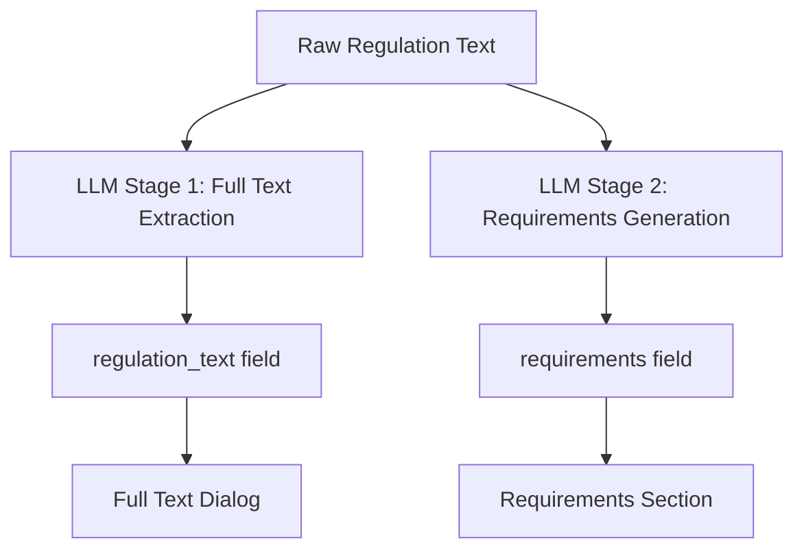

# 🤖 MCP Engine Requirements Generation Specification

## 🚨 Critical Issue Identified

**Problem**: The `requirements` field in EdSteward is currently populated with full regulation text instead of AI-generated, structured compliance requirements.

**Current State**:
- Regulation 55 (TEACH ACT): 3,102 chars of full text ❌
- Regulation 269: Basic text, not structured requirements ❌  
- Many regulations: "No specific requirements provided" ❌

**Required Solution**: MCP Engine needs a **second LLM process** to generate structured, actionable compliance requirements from the full regulation text.

---

## 🎯 Requirements Generation Specification

### 1. **Two-Stage LLM Process**



### 2. **LLM Stage 2: Requirements Generation Prompt**

```
SYSTEM: You are a compliance expert specializing in higher education regulations. Generate structured, actionable compliance requirements from regulation text.

USER: Analyze this regulation and generate specific compliance requirements for higher education institutions:

[REGULATION_TEXT]

Generate requirements in this exact format:

**Key Compliance Requirements:**

1. **[Requirement Category]**
   - [Specific actionable requirement]
   - [Implementation deadline/frequency if applicable]
   - [Responsible party/department]

2. **[Next Category]**
   - [Specific actionable requirement]
   - [Implementation details]

**Documentation Requirements:**
- [Required records/documentation]
- [Retention periods]

**Reporting Requirements:**
- [Required reports/submissions]
- [Submission deadlines]
- [Recipient agencies]

**Training Requirements:**
- [Required training programs]
- [Target audiences]
- [Frequency]

**Monitoring & Compliance:**
- [Ongoing monitoring activities]
- [Compliance verification methods]
- [Audit requirements]

Focus on actionable, specific requirements that compliance officers can implement. Avoid generic statements.
```

### 3. **Expected Output Format**

For **TEACH ACT (Regulation 55)**, the requirements should look like:

```
**Key Compliance Requirements:**

1. **Copyright Compliance for Digital Learning**
   - Implement technological measures to prevent unauthorized retention and distribution of copyrighted materials
   - Limit access to enrolled students for specific course sessions
   - Ensure materials are directly related to teaching content

2. **Faculty Training and Authorization**
   - Train faculty on TEACH Act limitations and requirements
   - Establish approval process for copyrighted material use in online courses
   - Document faculty acknowledgment of copyright responsibilities

**Documentation Requirements:**
- Maintain records of copyrighted materials used in courses
- Document technological protection measures implemented
- Retain course enrollment records for access verification

**Reporting Requirements:**
- No specific federal reporting required
- Internal compliance audits recommended annually

**Training Requirements:**
- Annual copyright training for all faculty using digital materials
- New faculty orientation on TEACH Act compliance
- IT staff training on technological protection measures

**Monitoring & Compliance:**
- Regular audits of online course materials
- Monitor technological protection measure effectiveness
- Review and update policies annually
```

### 4. **API Integration Update**

**Current Payload** (Stage 1 - Full Text):
```json
{
  "regulationId": 55,
  "name": "TEACH Act Full Text Update",
  "status": "pending",
  "content": {
    "uscText": {
      "text": "FULL_REGULATION_TEXT_HERE"
    }
  }
}
```

**New Payload** (Stage 2 - With Requirements):
```json
{
  "regulationId": 55,
  "name": "TEACH Act Complete Update",
  "status": "pending",
  "content": {
    "uscText": {
      "text": "FULL_REGULATION_TEXT_HERE"
    },
    "requirements": {
      "generated": true,
      "llmModel": "gpt-4",
      "generatedAt": "2025-01-30T12:00:00Z",
      "content": "**Key Compliance Requirements:**\n\n1. **Copyright Compliance...**"
    }
  }
}
```

### 5. **EdSteward API Update Required**

The regulation-updates API needs to handle the new requirements field:

```typescript
// In server/regulation-updates-api.ts
updateData = {
  regulationId: validRegulationId,
  name: mcpData.name,
  status: mcpData.status,
  originalContent: mcpData.content?.uscText?.text || "Original content from MCP Engine",
  updatedContent: JSON.stringify(mcpData.content, null, 2) || "Updated content from MCP Engine",
  // NEW: Handle requirements separately
  requirements: mcpData.content?.requirements?.content || null
};
```

### 6. **Implementation Priority**

**Phase 1: Fix Current Issues**
1. Clean up regulation 55 requirements field (remove full text)
2. Update EdSteward to handle requirements field in updates
3. Test with one regulation (TEACH ACT)

**Phase 2: LLM Requirements Generation**
1. Implement LLM Stage 2 in MCP Engine
2. Generate requirements for top 10 regulations
3. Validate output quality with compliance experts

**Phase 3: Full Rollout**
1. Generate requirements for all 354 regulations
2. Implement quality scoring and validation
3. Add requirements versioning and updates

### 7. **Quality Validation Criteria**

Generated requirements must:
- ✅ Be specific and actionable (not generic)
- ✅ Include implementation details where applicable
- ✅ Specify responsible parties/departments
- ✅ Include deadlines, frequencies, and timelines
- ✅ Cover documentation and reporting requirements
- ✅ Be relevant to higher education institutions
- ✅ Avoid legal jargon, use plain language
- ✅ Be structured consistently across regulations

### 8. **Testing Process**

1. **Generate requirements** for regulation 55 using LLM Stage 2
2. **Send update** to EdSteward with both full text and requirements
3. **Verify separation**: 
   - Full text appears in "View Full Text" dialog
   - Requirements appear in Requirements section
4. **Quality review** by compliance expert
5. **Iterate** on prompt and process

---

## 🛠️ MCP Engine Implementation Tasks

### Immediate (This Week)
- [ ] Implement LLM Stage 2 requirements generation
- [ ] Update API payload to include requirements field
- [ ] Test with TEACH ACT (regulation 55)

### Short Term (Next Week)  
- [ ] Generate requirements for top 10 regulations
- [ ] Implement quality validation scoring
- [ ] Update EdSteward API to handle requirements field

### Medium Term (Next Month)
- [ ] Full rollout to all 354 regulations
- [ ] Implement requirements versioning
- [ ] Add compliance expert review workflow

---

## 🎯 Success Metrics

- **Separation**: Full text and requirements are distinct
- **Quality**: Requirements are actionable and specific
- **Coverage**: All 354 regulations have generated requirements
- **Usability**: Compliance officers can implement requirements
- **Accuracy**: Requirements align with legal obligations

This specification provides the MCP Engine team with everything needed to implement proper requirements generation and fix the current full text contamination issue.
