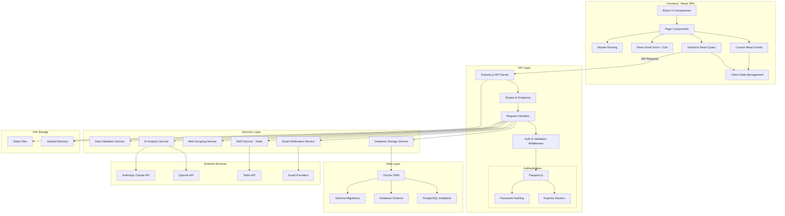
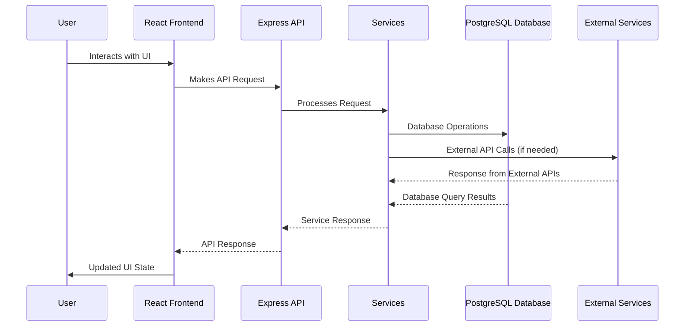
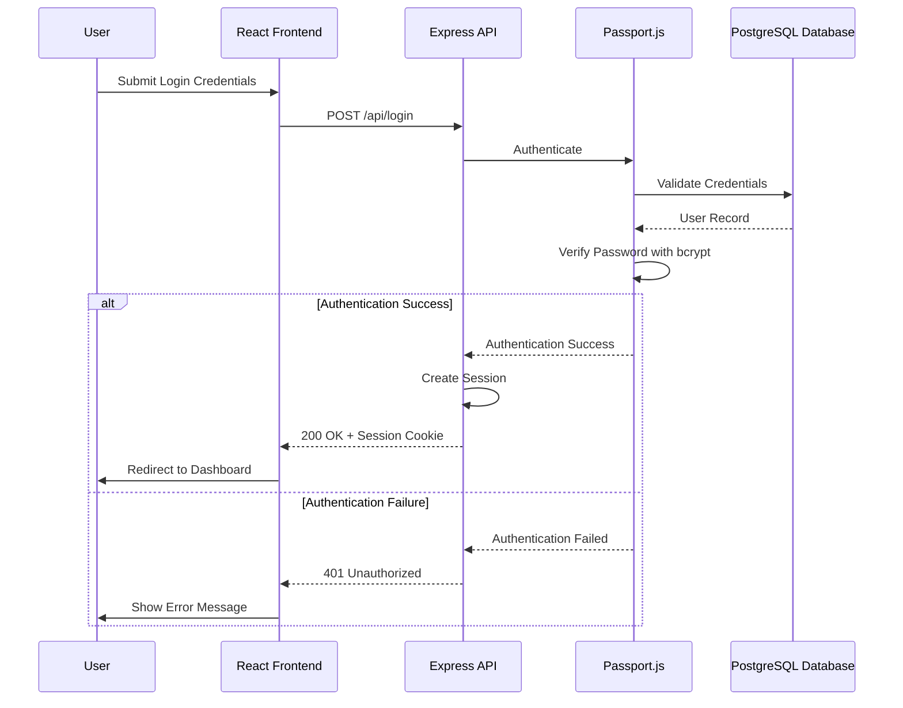
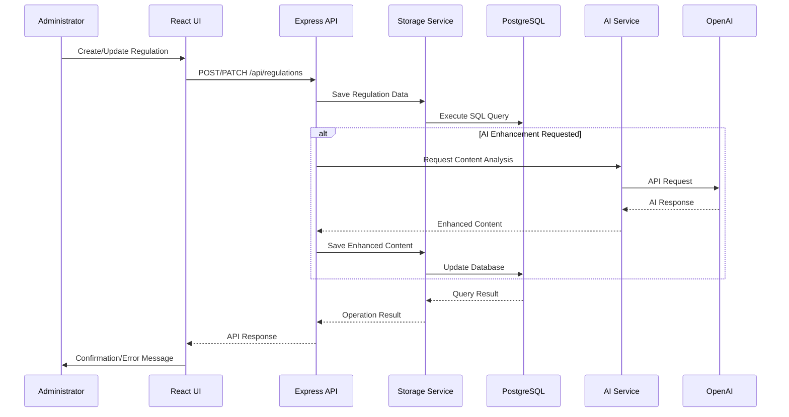
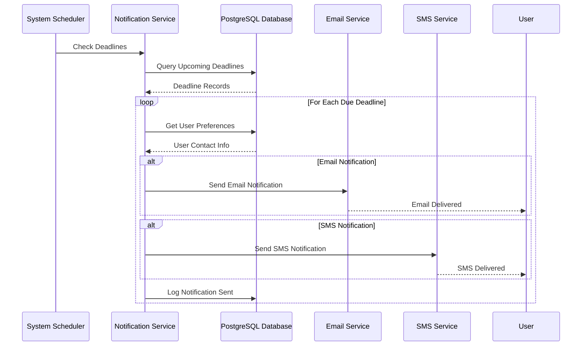

# Regulatory Compliance Platform Architecture Diagram

## System Flow Overview

## Authentication Flow

## Data Flow for Regulation Management

## Deadline Notification Flow

These diagrams provide a visual representation of the system architecture and key workflows in the Regulatory Compliance Platform.