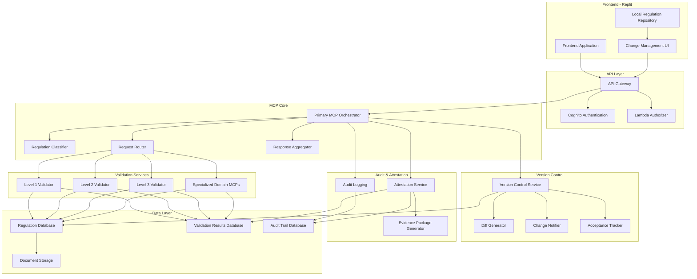
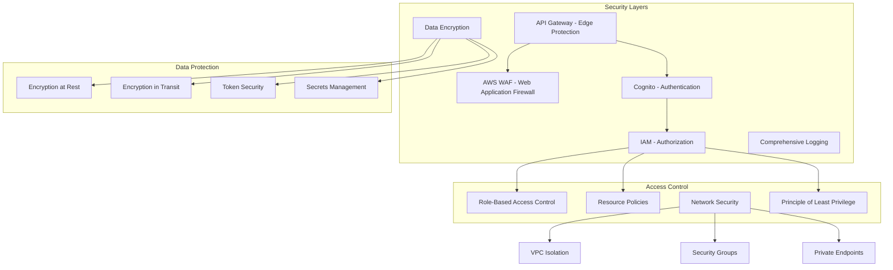
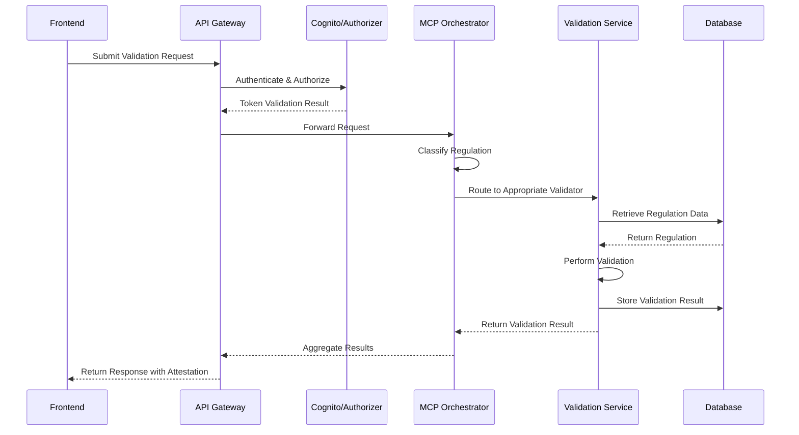
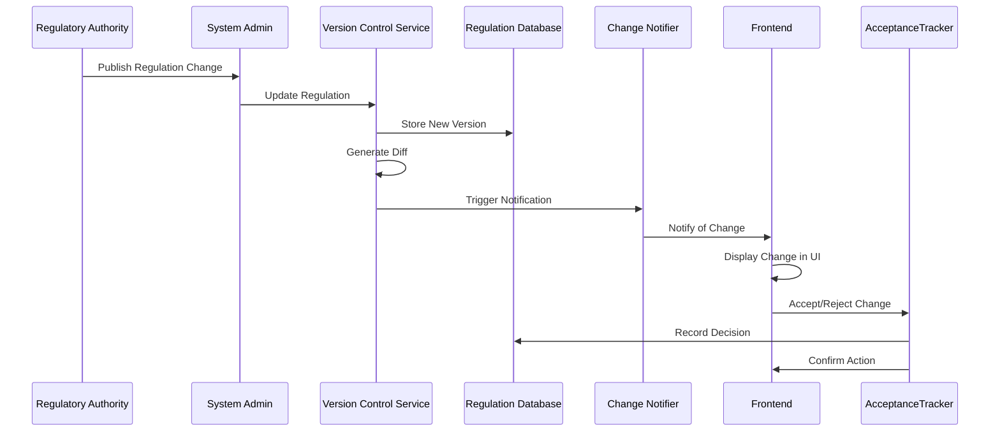
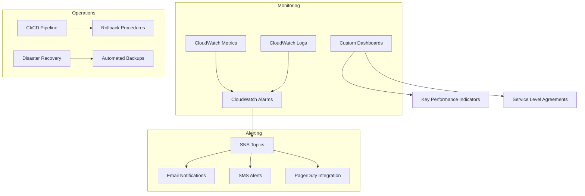

# MCP Software Engine - Technical Architecture

## System Overview

The Compliance Tracker MCP (Model Context Protocol) System is designed as a hierarchical, serverless architecture that separates regulation validation logic from the frontend application. The system provides multiple levels of validation intensity, version control, and attestation services for regulatory compliance.

## Component Details

### Frontend Components

1. **Frontend Application**
   - Existing Replit-based application
   - Maintains its own regulation interpretations
   - Submits data for validation to the MCP backend

2. **Local Regulation Repository**
   - Stores frontend's interpretation of regulations
   - Manages local version history
   - Tracks changes from backend validation

3. **Change Management UI**
   - Displays regulatory changes detected by backend
   - Provides accept/reject workflow for changes
   - Shows diff visualizations of changes

### API Layer

1. **API Gateway**
   - Entry point for all frontend requests
   - Enforces request validation
   - Handles CORS for frontend integration
   - Implements rate limiting and throttling

2. **Cognito Authentication**
   - User authentication and session management
   - Issues JWT tokens for API access
   - Manages user groups and roles

3. **Lambda Authorizer**
   - Custom authorization logic
   - Validates JWT tokens
   - Applies role-based access control

### MCP Core

1. **Primary MCP Orchestrator**
   - Central coordinator for validation requests
   - Routes requests to appropriate validators
   - Aggregates responses from multiple validators
   - Handles versioning and audit logging

2. **Regulation Classifier**
   - Categorizes regulations by complexity
   - Determines appropriate validation level
   - Identifies specialized validators for specific domains

3. **Request Router**
   - Directs validation requests to appropriate services
   - Handles parallel processing for multi-part validations
   - Manages timeout and retry logic

4. **Response Aggregator**
   - Compiles results from multiple validators
   - Resolves conflicts between validation results
   - Formats consistent response structure

### Validation Services

1. **Level 1 Validator**
   - Handles static text-based regulations
   - Performs simple text comparison
   - Highly scalable for bulk validation
   - Suitable for regulations that rarely change

2. **Level 2 Validator**
   - Processes moderately complex regulations
   - Implements pattern matching and context-aware validation
   - Handles structured and semi-structured content

3. **Level 3 Validator**
   - Manages complex, frequently changing regulations
   - Incorporates workflow for edge cases
   - May integrate with human review for ambiguous cases
   - Supports decision trees and complex logic

4. **Specialized Domain MCPs**
   - Domain-specific validators (Financial, Privacy, Academic)
   - Implements validation logic for specialized regulatory domains
   - Autonomous services called by the Orchestrator

### Version Control

1. **Version Control Service**
   - Tracks changes in regulatory requirements
   - Manages regulation versioning
   - Handles compatibility between versions

2. **Diff Generator**
   - Creates human-readable explanations of regulatory changes
   - Highlights specific text changes
   - Generates structured diff format for frontend display

3. **Change Notifier**
   - Alerts frontend about regulatory updates
   - Prioritizes notifications by impact
   - Tracks notification status

4. **Acceptance Tracker**
   - Records frontend acceptance/rejection of changes
   - Manages transition periods for regulatory updates
   - Provides audit trail of change management

### Audit & Attestation

1. **Audit Logging**
   - Records all system activities
   - Creates immutable audit trail
   - Supports compliance investigations

2. **Attestation Service**
   - Generates validation certificates
   - Documents validation level and confidence
   - Provides cryptographic proof of validation

3. **Evidence Package Generator**
   - Compiles validation results for external auditors
   - Creates downloadable evidence packages
   - Formats data for regulatory submissions

### Data Layer

1. **Regulation Database**
   - Stores authoritative regulation sources
   - Maintains version history
   - Tracks regulatory metadata and classification

2. **Validation Results Database**
   - Records validation outcomes
   - Stores validation context and evidence
   - Links results to specific regulation versions

3. **Audit Trail Database**
   - Immutable record of system activities
   - Implemented with Amazon QLDB for cryptographic verification
   - Supports compliance and forensic analysis

4. **Document Storage**
   - S3-based storage for regulation documents
   - Versioned storage for evidence artifacts
   - Secure, encrypted document management

## Implementation Technology

### AWS Services

- **Compute**: AWS Lambda for serverless functions
- **API**: Amazon API Gateway for REST API
- **Authentication**: Amazon Cognito for user management
- **Database**: Amazon Aurora PostgreSQL for relational data
- **Immutable Logs**: Amazon QLDB for tamper-proof audit trail
- **Storage**: Amazon S3 for document and artifact storage
- **Monitoring**: Amazon CloudWatch for logs and metrics
- **Deployment**: AWS CloudFormation or Terraform for infrastructure as code

### Development Stack

- **Runtime**: Node.js for Lambda functions
- **ORM**: Knex.js for database operations
- **Validation**: JSON Schema for request/response validation
- **Testing**: Jest for automated testing
- **Documentation**: OpenAPI/Swagger for API documentation
- **CI/CD**: GitHub Actions for continuous integration/deployment

## Security Architecture

## Data Flow

### Validation Request Flow

### Version Control Flow

## Scalability and Resilience

The architecture is designed to scale horizontally with increasing load:

1. **Serverless Compute**: Lambda functions automatically scale with request volume
2. **Database Scaling**: Aurora PostgreSQL provides read scalability and fail-over
3. **Stateless Design**: All components are stateless, allowing for easy scaling
4. **Caching Strategy**: Multi-level caching reduces database load
5. **Asynchronous Processing**: Non-critical work is offloaded to background tasks
6. **Circuit Breaking**: Prevent cascading failures through circuit breaking patterns
7. **Retry Logic**: Implement exponential backoff for transient failures
8. **Dead Letter Queues**: Capture and retry failed operations

## Monitoring and Operations

## Deployment Process

The system will be deployed in stages using infrastructure as code:

1. **Development Environment**: Initial development and testing
2. **Staging Environment**: Pre-production validation
3. **Production Environment**: Full deployment
4. **Disaster Recovery**: Backup and recovery procedures

Each deployment follows these steps:

1. Infrastructure deployment (Terraform)
2. Database schema updates
3. Lambda function deployment
4. API Gateway configuration
5. Testing and validation
6. Monitoring setup
7. Documentation updates

## Future Expansion

The architecture is designed to accommodate future enhancements:

1. **Multi-Tenant Support**: Partition data for multiple institutions
2. **AI-Enhanced Validation**: Machine learning for improved accuracy
3. **Integration API**: Connect with third-party compliance systems
4. **Mobile Access**: Support for mobile applications
5. **Advanced Analytics**: Compliance trend analysis and reporting
6. **Marketplace**: Framework for third-party validator plugins
