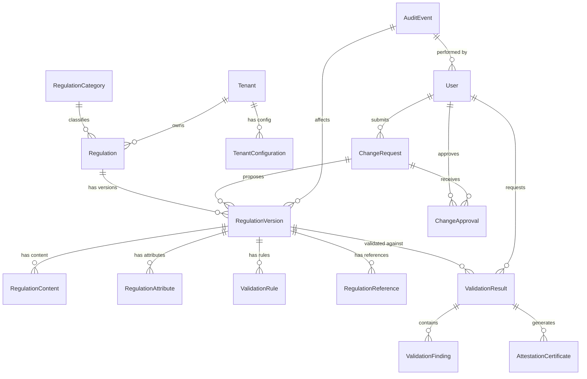

# Regulation Data Model

## 1. Introduction

This document defines the data model for storing and managing regulations within the Compliance Tracker MCP system. The model is designed to support versioning, auditing, and multi-tenant scenarios for future commercialization.

## 2. Data Model Overview

The data model consists of several interconnected entities:



## 3. Core Entities

### 3.1 Regulation

The `Regulation` entity represents a regulatory framework or compliance standard.

| Column | Type | Description | Example |
|--------|------|-------------|---------|
| regulation_id | UUID | Primary key | "550e8400-e29b-41d4-a716-446655440000" |
| code | VARCHAR(50) | Unique code identifier | "FERPA-SR" |
| name | VARCHAR(255) | Human-readable name | "FERPA Student Records" |
| description | TEXT | Detailed description | "Federal regulation governing student education records..." |
| category_id | UUID | Reference to category | "71f0d7e5-9d8b-4b7c-8709-dfba18a9787c" |
| complexity_level | INTEGER | Validation level (1-4) | 2 |
| tenant_id | UUID | Multi-tenancy support | "8a7b6c5d-4e3f-2a1b-0c9d-8e7f6a5b4c3d" |
| is_active | BOOLEAN | Activation status | true |
| created_at | TIMESTAMP | Creation timestamp | "2024-12-01T14:30:00Z" |
| updated_at | TIMESTAMP | Last update timestamp | "2025-03-15T09:45:00Z" |

### 3.2 RegulationVersion

The `RegulationVersion` entity tracks different versions of a regulation over time.

| Column | Type | Description | Example |
|--------|------|-------------|---------|
| version_id | UUID | Primary key | "660e8400-e29b-41d4-a716-446655440001" |
| regulation_id | UUID | Reference to regulation | "550e8400-e29b-41d4-a716-446655440000" |
| version_number | VARCHAR(50) | Version identifier | "2023.08.22" |
| status | VARCHAR(50) | Status of this version | "ACTIVE", "DRAFT", "DEPRECATED" |
| effective_date | TIMESTAMP | When version takes effect | "2023-08-22T00:00:00Z" |
| expiration_date | TIMESTAMP | When version expires | "2025-08-22T00:00:00Z" |
| change_summary | TEXT | Summary of changes | "Updated digital consent requirements..." |
| change_request_id | UUID | Reference to change request | "990e8400-e29b-41d4-a716-446655440009" |
| is_authoritative | BOOLEAN | If this is official version | true |
| created_at | TIMESTAMP | Creation timestamp | "2023-08-01T10:15:00Z" |
| updated_at | TIMESTAMP | Last update timestamp | "2023-08-20T16:30:00Z" |
| created_by | UUID | User who created version | "330e8400-e29b-41d4-a716-446655440333" |

### 3.3 RegulationContent

The `RegulationContent` entity stores the actual content of regulation versions.

| Column | Type | Description | Example |
|--------|------|-------------|---------|
| content_id | UUID | Primary key | "770e8400-e29b-41d4-a716-446655440002" |
| version_id | UUID | Reference to version | "660e8400-e29b-41d4-a716-446655440001" |
| section_code | VARCHAR(50) | Section identifier | "99.30" |
| section_title | VARCHAR(255) | Section title | "Disclosure Requirements" |
| content_type | VARCHAR(50) | Content format | "TEXT", "HTML", "JSON" |
| content | TEXT | Actual content | "Educational institutions must obtain written consent..." |
| order_index | INTEGER | Order within regulation | 5 |
| parent_section_code | VARCHAR(50) | Parent section | "99" |
| created_at | TIMESTAMP | Creation timestamp | "2023-08-01T10:20:00Z" |
| updated_at | TIMESTAMP | Last update timestamp | "2023-08-20T16:35:00Z" |

### 3.4 ValidationRule

The `ValidationRule` entity defines rules for validating compliance.

| Column | Type | Description | Example |
|--------|------|-------------|---------|
| rule_id | UUID | Primary key | "880e8400-e29b-41d4-a716-446655440003" |
| version_id | UUID | Reference to version | "660e8400-e29b-41d4-a716-446655440001" |
| rule_code | VARCHAR(50) | Rule identifier | "FERPA-SR-CONSENT-01" |
| rule_name | VARCHAR(255) | Rule name | "Digital Consent Verification" |
| description | TEXT | Rule description | "Digital consent must use multi-factor verification" |
| severity | VARCHAR(50) | Severity level | "ERROR", "WARNING", "INFO" |
| validation_level | INTEGER | Minimum level required | 2 |
| data_path | VARCHAR(255) | JSON path to validate | "data.studentRecords[].recipients[].consentDocumentation.verificationMethod" |
| validation_type | VARCHAR(50) | Type of validation | "PATTERN", "EXISTS", "COMPARISON" |
| validation_params | JSONB | Validation parameters | {"pattern": "^(mfa|two-factor|multi-factor).*$", "flags": "i"} |
| reference_section | VARCHAR(50) | Reference to regulation | "99.30(d)(4)" |
| message_template | TEXT | Error message template | "Verification method '{value}' does not meet MFA requirement" |
| created_at | TIMESTAMP | Creation timestamp | "2023-08-01T11:30:00Z" |
| updated_at | TIMESTAMP | Last update timestamp | "2023-08-20T16:40:00Z" |
| created_by | UUID | User who created rule | "330e8400-e29b-41d4-a716-446655440333" |

## 4. Supporting Entities

### 4.1 RegulationCategory

The `RegulationCategory` entity classifies regulations by domain.

| Column | Type | Description | Example |
|--------|------|-------------|---------|
| category_id | UUID | Primary key | "71f0d7e5-9d8b-4b7c-8709-dfba18a9787c" |
| name | VARCHAR(255) | Category name | "Education Privacy" |
| description | TEXT | Category description | "Regulations governing privacy in educational settings" |
| parent_category_id | UUID | Parent category | "61f0d7e5-9d8b-4b7c-8709-dfba18a9787c" |
| tenant_id | UUID | Multi-tenancy support | "8a7b6c5d-4e3f-2a1b-0c9d-8e7f6a5b4c3d" |
| created_at | TIMESTAMP | Creation timestamp | "2023-07-15T08:00:00Z" |
| updated_at | TIMESTAMP | Last update timestamp | "2023-07-15T08:00:00Z" |

### 4.2 RegulationAttribute

The `RegulationAttribute` entity stores additional metadata about regulations.

| Column | Type | Description | Example |
|--------|------|-------------|---------|
| attribute_id | UUID | Primary key | "91f0d7e5-9d8b-4b7c-8709-dfba18a9787d" |
| version_id | UUID | Reference to version | "660e8400-e29b-41d4-a716-446655440001" |
| key | VARCHAR(255) | Attribute name | "jurisdiction" |
| value | TEXT | Attribute value | "federal" |
| created_at | TIMESTAMP | Creation timestamp | "2023-08-01T10:25:00Z" |
| updated_at | TIMESTAMP | Last update timestamp | "2023-08-01T10:25:00Z" |

### 4.3 RegulationReference

The `RegulationReference` entity tracks references between regulations.

| Column | Type | Description | Example |
|--------|------|-------------|---------|
| reference_id | UUID | Primary key | "a1f0d7e5-9d8b-4b7c-8709-dfba18a9787e" |
| source_version_id | UUID | Source regulation version | "660e8400-e29b-41d4-a716-446655440001" |
| target_regulation_id | UUID | Target regulation | "550e8400-e29b-41d4-a716-446655440010" |
| target_version_id | UUID | Target regulation version | "660e8400-e29b-41d4-a716-446655440011" |
| reference_type | VARCHAR(50) | Type of reference | "INCORPORATES", "SUPERSEDES", "RELATES_TO" |
| description | TEXT | Reference description | "References data security requirements from GLBA" |
| source_section_code | VARCHAR(50) | Source section | "99.30" |
| target_section_code | VARCHAR(50) | Target section | "314.4" |
| created_at | TIMESTAMP | Creation timestamp | "2023-08-05T14:20:00Z" |
| updated_at | TIMESTAMP | Last update timestamp | "2023-08-05T14:20:00Z" |

## 5. Validation and Attestation Entities

### 5.1 ValidationResult

The `ValidationResult` entity records validation outcomes.

| Column | Type | Description | Example |
|--------|------|-------------|---------|
| result_id | UUID | Primary key | "b1f0d7e5-9d8b-4b7c-8709-dfba18a9787f" |
| regulation_id | UUID | Reference to regulation | "550e8400-e29b-41d4-a716-446655440000" |
| version_id | UUID | Reference to version | "660e8400-e29b-41d4-a716-446655440001" |
| user_id | UUID | User who requested | "330e8400-e29b-41d4-a716-446655440333" |
| tenant_id | UUID | Multi-tenancy support | "8a7b6c5d-4e3f-2a1b-0c9d-8e7f6a5b4c3d" |
| request_id | VARCHAR(50) | Client request ID | "req-123e4567-e89b-12d3-a456-426614174000" |
| status | VARCHAR(50) | Overall validation status | "PASS", "FAIL", "PARTIAL" |
| confidence | DECIMAL | Confidence score (0-1) | 0.98 |
| validation_level | INTEGER | Validation level used | 2 |
| data_hash | VARCHAR(100) | Hash of validated data | "sha256:1234abcd..." |
| validation_date | TIMESTAMP | When validation occurred | "2025-04-16T14:30:05Z" |
| processing_time_ms | INTEGER | Processing time | 450 |
| validator_id | VARCHAR(50) | Validator identifier | "level2-validator-12" |
| client_info | JSONB | Client information | {"id": "university-frontend", "version": "2.3.0"} |
| created_at | TIMESTAMP | Creation timestamp | "2025-04-16T14:30:05Z" |

### 5.2 ValidationFinding

The `ValidationFinding` entity stores individual validation findings.

| Column | Type | Description | Example |
|--------|------|-------------|---------|
| finding_id | UUID | Primary key | "c1f0d7e5-9d8b-4b7c-8709-dfba18a9788g" |
| result_id | UUID | Reference to result | "b1f0d7e5-9d8b-4b7c-8709-dfba18a9787f" |
| finding_code | VARCHAR(50) | Finding identifier | "find-001" |
| rule_id | UUID | Reference to rule | "880e8400-e29b-41d4-a716-446655440003" |
| path | VARCHAR(255) | Path to data element | "data.studentRecords[0].recipients[0].consentDocumentation.verificationMethod" |
| severity | VARCHAR(50) | Severity level | "ERROR", "WARNING", "INFO" |
| message | TEXT | Finding message | "Email confirmation alone does not meet multi-factor verification requirement" |
| reference | VARCHAR(100) | Regulation reference | "FERPA §99.30(d)(4)" |
| data_value | TEXT | Actual value found | "email confirmation" |
| expected_value | TEXT | Expected value | "multi-factor verification" |
| created_at | TIMESTAMP | Creation timestamp | "2025-04-16T14:30:05Z" |

### 5.3 AttestationCertificate

The `AttestationCertificate` entity stores validation attestations.

| Column | Type | Description | Example |
|--------|------|-------------|---------|
| attestation_id | UUID | Primary key | "d1f0d7e5-9d8b-4b7c-8709-dfba18a9788h" |
| result_id | UUID | Reference to result | "b1f0d7e5-9d8b-4b7c-8709-dfba18a9787f" |
| certificate_id | VARCHAR(100) | Public certificate ID | "att-123e4567-e89b-12d3-a456-426614174000" |
| issue_date | TIMESTAMP | When issued | "2025-04-16T14:30:05Z" |
| expiration_date | TIMESTAMP | When expires | "2025-07-16T14:30:05Z" |
| level | INTEGER | Validation level | 2 |
| confidence | DECIMAL | Confidence score (0-1) | 0.98 |
| status | VARCHAR(50) | Certificate status | "ACTIVE", "REVOKED", "EXPIRED" |
| signature | TEXT | Cryptographic signature | "HMAC-SHA256-BASE64-SIGNATURE" |
| signature_algorithm | VARCHAR(50) | Algorithm used | "HMAC-SHA256" |
| verification_url | VARCHAR(255) | Verification URL | "https://api.compliance-tracker.edu/verify/att-123e4567-e89b-12d3-a456-426614174000" |
| revocation_date | TIMESTAMP | When revoked (if any) | null |
| revocation_reason | TEXT | Why revoked (if any) | null |
| created_at | TIMESTAMP | Creation timestamp | "2025-04-16T14:30:05Z" |

## 6. Change Management Entities

### 6.1 ChangeRequest

The `ChangeRequest` entity tracks proposed changes to regulations.

| Column | Type | Description | Example |
|--------|------|-------------|---------|
| request_id | UUID | Primary key | "990e8400-e29b-41d4-a716-446655440009" |
| regulation_id | UUID | Reference to regulation | "550e8400-e29b-41d4-a716-446655440000" |
| base_version_id | UUID | Version being modified | "660e8400-e29b-41d4-a716-446655440001" |
| title | VARCHAR(255) | Change request title | "Update Digital Consent Requirements" |
| description | TEXT | Detailed description | "Update verification requirements for digital consent to require MFA" |
| status | VARCHAR(50) | Request status | "DRAFT", "PENDING", "APPROVED", "REJECTED" |
| priority | VARCHAR(50) | Change priority | "HIGH", "MEDIUM", "LOW" |
| source | VARCHAR(50) | Change source | "REGULATORY", "INTERNAL", "CUSTOMER" |
| source_reference | VARCHAR(255) | External reference | "Federal Register Vol. 88, No. 123" |
| effective_date | TIMESTAMP | When change takes effect | "2025-01-01T00:00:00Z" |
| submitted_by | UUID | User who submitted | "330e8400-e29b-41d4-a716-446655440333" |
| submitted_at | TIMESTAMP | Submission timestamp | "2023-07-10T09:15:00Z" |
| tenant_id | UUID | Multi-tenancy support | "8a7b6c5d-4e3f-2a1b-0c9d-8e7f6a5b4c3d" |
| created_at | TIMESTAMP | Creation timestamp | "2023-07-05T16:20:00Z" |
| updated_at | TIMESTAMP | Last update timestamp | "2023-07-15T10:30:00Z" |

### 6.2 ChangeApproval

The `ChangeApproval` entity tracks the approval process for changes.

| Column | Type | Description | Example |
|--------|------|-------------|---------|
| approval_id | UUID | Primary key | "e1f0d7e5-9d8b-4b7c-8709-dfba18a9788i" |
| request_id | UUID | Reference to change request | "990e8400-e29b-41d4-a716-446655440009" |
| approver_id | UUID | User who approved/rejected | "440e8400-e29b-41d4-a716-446655440444" |
| decision | VARCHAR(50) | Approval decision | "APPROVED", "REJECTED", "NEEDS_REVISION" |
| comments | TEXT | Approval comments | "Updated verification requirements are appropriate" |
| approval_date | TIMESTAMP | Decision timestamp | "2023-07-18T13:45:00Z" |
| approval_level | INTEGER | Level in approval process | 2 |
| created_at | TIMESTAMP | Creation timestamp | "2023-07-15T11:00:00Z" |
| updated_at | TIMESTAMP | Last update timestamp | "2023-07-18T13:45:00Z" |

## 7. Multi-Tenant Entities

### 7.1 Tenant

The `Tenant` entity supports multi-tenant architecture for commercialization.

| Column | Type | Description | Example |
|--------|------|-------------|---------|
| tenant_id | UUID | Primary key | "8a7b6c5d-4e3f-2a1b-0c9d-8e7f6a5b4c3d" |
| name | VARCHAR(255) | Organization name | "State University" |
| code | VARCHAR(50) | Short identifier | "stateuniv" |
| domain | VARCHAR(255) | Primary domain | "stateuniv.edu" |
| status | VARCHAR(50) | Tenant status | "ACTIVE", "INACTIVE", "SUSPENDED" |
| tier | VARCHAR(50) | Service tier | "BASIC", "PROFESSIONAL", "ENTERPRISE" |
| created_at | TIMESTAMP | Creation timestamp | "2023-06-01T00:00:00Z" |
| updated_at | TIMESTAMP | Last update timestamp | "2023-06-01T00:00:00Z" |

### 7.2 TenantConfiguration

The `TenantConfiguration` entity stores tenant-specific settings.

| Column | Type | Description | Example |
|--------|------|-------------|---------|
| config_id | UUID | Primary key | "f1f0d7e5-9d8b-4b7c-8709-dfba18a9788j" |
| tenant_id | UUID | Reference to tenant | "8a7b6c5d-4e3f-2a1b-0c9d-8e7f6a5b4c3d" |
| category | VARCHAR(50) | Configuration category | "VALIDATION", "UI", "NOTIFICATION" |
| key | VARCHAR(255) | Configuration key | "default_validation_level" |
| value | TEXT | Configuration value | "2" |
| is_encrypted | BOOLEAN | If value is encrypted | false |
| description | TEXT | Setting description | "Default validation level for all regulations" |
| created_at | TIMESTAMP | Creation timestamp | "2023-06-01T09:30:00Z" |
| updated_at | TIMESTAMP | Last update timestamp | "2023-06-15T14:20:00Z" |

## 8. User and Audit Entities

### 8.1 User

The `User` entity stores user information.

| Column | Type | Description | Example |
|--------|------|-------------|---------|
| user_id | UUID | Primary key | "330e8400-e29b-41d4-a716-446655440333" |
| username | VARCHAR(100) | Login username | "jsmith" |
| email | VARCHAR(255) | Email address | "jsmith@stateuniv.edu" |
| first_name | VARCHAR(100) | First name | "John" |
| last_name | VARCHAR(100) | Last name | "Smith" |
| status | VARCHAR(50) | Account status | "ACTIVE", "INACTIVE", "LOCKED" |
| tenant_id | UUID | Reference to tenant | "8a7b6c5d-4e3f-2a1b-0c9d-8e7f6a5b4c3d" |
| created_at | TIMESTAMP | Creation timestamp | "2023-05-15T10:00:00Z" |
| updated_at | TIMESTAMP | Last update timestamp | "2023-05-15T10:00:00Z" |
| last_login_at | TIMESTAMP | Last login timestamp | "2025-04-16T08:15:00Z" |

### 8.2 UserRole

The `UserRole` entity defines user roles and permissions.

| Column | Type | Description | Example |
|--------|------|-------------|---------|
| role_id | UUID | Primary key | "g1f0d7e5-9d8b-4b7c-8709-dfba18a9788k" |
| user_id | UUID | Reference to user | "330e8400-e29b-41d4-a716-446655440333" |
| role | VARCHAR(50) | Role name | "ADMIN", "VALIDATOR", "VIEWER" |
| scope | VARCHAR(100) | Role scope | "GLOBAL", "REGULATION:FERPA-SR" |
| tenant_id | UUID | Reference to tenant | "8a7b6c5d-4e3f-2a1b-0c9d-8e7f6a5b4c3d" |
| created_at | TIMESTAMP | Creation timestamp | "2023-05-15T10:05:00Z" |
| updated_at | TIMESTAMP | Last update timestamp | "2023-05-15T10:05:00Z" |
| created_by | UUID | User who created role | "440e8400-e29b-41d4-a716-446655440444" |

### 8.3 AuditEvent

The `AuditEvent` entity maintains an immutable audit trail.

| Column | Type | Description | Example |
|--------|------|-------------|---------|
| event_id | UUID | Primary key | "h1f0d7e5-9d8b-4b7c-8709-dfba18a9788l" |
| event_type | VARCHAR(100) | Type of event | "REGULATION_UPDATE", "VALIDATION_REQUEST", "ATTESTATION_ISSUE" |
| event_timestamp | TIMESTAMP | When event occurred | "2025-04-16T14:30:05Z" |
| user_id | UUID | User who performed action | "330e8400-e29b-41d4-a716-446655440333" |
| regulation_id | UUID | Related regulation (if any) | "550e8400-e29b-41d4-a716-446655440000" |
| version_id | UUID | Related version (if any) | "660e8400-e29b-41d4-a716-446655440001" |
| resource_type | VARCHAR(100) | Type of affected resource | "REGULATION", "USER", "ATTESTATION" |
| resource_id | UUID | Identifier for resource | "550e8400-e29b-41d4-a716-446655440000" |
| action | VARCHAR(50) | Action performed | "CREATE", "UPDATE", "DELETE", "VIEW" |
| description | TEXT | Event description | "Updated digital consent verification requirements" |
| ip_address | VARCHAR(50) | Source IP address | "192.168.1.100" |
| user_agent | VARCHAR(255) | User agent string | "Mozilla/5.0 (Windows NT 10.0...)..." |
| tenant_id | UUID | Reference to tenant | "8a7b6c5d-4e3f-2a1b-0c9d-8e7f6a5b4c3d" |
| additional_data | JSONB | Additional event data | {"browser": "Chrome", "os": "Windows 10"} |
| hash | VARCHAR(100) | Cryptographic event hash | "sha256:1234abcd..." |
| prev_hash | VARCHAR(100) | Hash of previous event | "sha256:5678efgh..." |

## 9. Database Schema Migration

The database schema will evolve over time. To manage changes:

1. Use sequential migration files
2. Track dependencies between migrations
3. Maintain backward compatibility when possible
4. Document migration steps

### 9.1 Initial Schema Migration

The initial migration will create all core tables:

```sql
-- Create Regulation table
CREATE TABLE regulation (
    regulation_id UUID PRIMARY KEY DEFAULT gen_random_uuid(),
    code VARCHAR(50) NOT NULL UNIQUE,
    name VARCHAR(255) NOT NULL,
    description TEXT,
    category_id UUID,
    complexity_level INTEGER NOT NULL DEFAULT 1,
    tenant_id UUID,
    is_active BOOLEAN NOT NULL DEFAULT true,
    created_at TIMESTAMP WITH TIME ZONE NOT NULL DEFAULT now(),
    updated_at TIMESTAMP WITH TIME ZONE NOT NULL DEFAULT now()
);

-- Create RegulationVersion table
CREATE TABLE regulation_version (
    version_id UUID PRIMARY KEY DEFAULT gen_random_uuid(),
    regulation_id UUID NOT NULL REFERENCES regulation(regulation_id),
    version_number VARCHAR(50) NOT NULL,
    status VARCHAR(50) NOT NULL DEFAULT 'DRAFT',
    effective_date TIMESTAMP WITH TIME ZONE,
    expiration_date TIMESTAMP WITH TIME ZONE,
    change_summary TEXT,
    change_request_id UUID,
    is_authoritative BOOLEAN NOT NULL DEFAULT false,
    created_at TIMESTAMP WITH TIME ZONE NOT NULL DEFAULT now(),
    updated_at TIMESTAMP WITH TIME ZONE NOT NULL DEFAULT now(),
    created_by UUID,
    UNIQUE(regulation_id, version_number)
);

-- Additional table creation statements...
```

## 10. Data Access Patterns

The data model supports these key access patterns:

### 10.1 Regulation Validation

1. Retrieve latest authoritative version of a regulation
2. Fetch validation rules for a specific regulation version
3. Store validation results with detailed findings
4. Generate attestation certificates for successful validations

### 10.2 Version Management

1. Check if regulation has newer version than frontend
2. Generate diffs between regulation versions
3. Track frontend acceptance of regulation updates
4. Maintain history of version changes

### 10.3 Audit and Compliance

1. Retrieve complete audit history for a regulation
2. Verify integrity of audit trail
3. Generate compliance reports for time periods
4. Search for specific audit events

### 10.4 Multi-Tenant Operations

1. Isolate data between tenants
2. Support tenant-specific regulation customizations
3. Enable global regulations shared across tenants
4. Configure tenant-specific validation settings

## 11. Versioning Strategy

### 11.1 Semantic Versioning

Regulations follow semantic versioning principles:

- **Major Version**: Incompatible changes (e.g., `2023`)
- **Minor Version**: New requirements, backward compatible (e.g., `2023.08`)
- **Patch Version**: Clarifications, corrections (e.g., `2023.08.22`)

### 11.2 Version Compatibility

1. Frontend can specify which version it's using
2. Backend stores and validates against latest authoritative version
3. Differences are reported through diff mechanism
4. Frontend can accept or reject version updates

## 12. Security Considerations

### 12.1 Data Protection

1. Sensitive data encrypted at rest (column-level encryption)
2. Cryptographic signatures for attestations
3. Access control at row and column level

### 12.2 Audit Integrity

1. Immutable audit trail using hash chaining
2. Cryptographic verification of audit events
3. Preservation of all historical records

## 13. Performance Optimization

### 13.1 Indexing Strategy

Key indexes to optimize query performance:

```sql
-- Regulation indexes
CREATE INDEX idx_regulation_tenant ON regulation(tenant_id);
CREATE INDEX idx_regulation_category ON regulation(category_id);
CREATE INDEX idx_regulation_code ON regulation(code);

-- RegulationVersion indexes
CREATE INDEX idx_regulation_version_regulation ON regulation_version(regulation_id);
CREATE INDEX idx_regulation_version_status ON regulation_version(status);
CREATE INDEX idx_regulation_version_effective ON regulation_version(effective_date);

-- ValidationResult indexes
CREATE INDEX idx_validation_result_regulation ON validation_result(regulation_id);
CREATE INDEX idx_validation_result_version ON validation_result(version_id);
CREATE INDEX idx_validation_result_tenant ON validation_result(tenant_id);
CREATE INDEX idx_validation_result_date ON validation_result(validation_date);

-- Additional indexes...
```

### 13.2 Denormalization Strategies

For performance optimization, consider these denormalizations:

1. Cached validation rule sets for frequently used regulations
2. Materialized views for common reporting queries
3. Pre-computed diffs between consecutive versions

## 14. Database Migration and Evolution

As the system evolves, database modifications will follow these principles:

1. **Additive Changes**: Prefer adding new tables/columns over modifying existing ones
2. **Backward Compatibility**: Maintain support for existing clients
3. **Phased Migration**: Deploy schema changes separately from code changes
4. **Feature Flags**: Use configuration to control new functionality

## 15. Sample Queries

### 15.1 Get Latest Regulation Version

```sql
SELECT v.*
FROM regulation_version v
JOIN regulation r ON v.regulation_id = r.regulation_id
WHERE r.code = 'FERPA-SR'
  AND v.is_authoritative = true
  AND v.status = 'ACTIVE'
  AND (v.expiration_date IS NULL OR v.expiration_date > CURRENT_TIMESTAMP)
ORDER BY v.effective_date DESC
LIMIT 1;
```

### 15.2 Find Validation Rules by Regulation

```sql
SELECT vr.*
FROM validation_rule vr
JOIN regulation_version rv ON vr.version_id = rv.version_id
JOIN regulation r ON rv.regulation_id = r.regulation_id
WHERE r.code = 'FERPA-SR'
  AND rv.version_number = '2023.08.22'
  AND vr.validation_level <= 2
ORDER BY vr.rule_code;
```

### 15.3 Track Regulation Changes

```sql
SELECT rv.version_number, rv.effective_date, rv.change_summary,
       u.first_name || ' ' || u.last_name AS changed_by,
       cr.title AS change_request
FROM regulation_version rv
JOIN regulation r ON rv.regulation_id = r.regulation_id
LEFT JOIN "user" u ON rv.created_by = u.user_id
LEFT JOIN change_request cr ON rv.change_request_id = cr.request_id
WHERE r.code = 'FERPA-SR'
ORDER BY rv.effective_date DESC;
```
