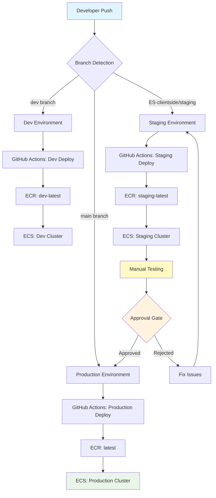

# EdSteward Deployment Pipeline Documentation

**Version**: 2.0.0  
**Last Updated**: January 2025  
**System**: Multi-Tenant Regulatory Compliance Platform  
**Infrastructure**: AWS ECS + GitHub Actions + Docker

---

## 🎯 **Executive Summary**

EdSteward employs a **multi-stage, safety-first deployment pipeline** designed for a multi-tenant SaaS platform serving educational institutions. The pipeline ensures zero-downtime deployments, complete tenant isolation, and comprehensive testing at every stage.

### **Key Pipeline Features**
- 🛡️ **Safety Gates**: Human approval required for production deployments
- 🔄 **Multi-Environment**: Dev → Staging → Production progression
- 🏗️ **Containerized**: Docker + AWS ECS for consistent deployments
- 🔍 **Health Monitoring**: Comprehensive health checks and rollback capabilities
- 🏢 **Multi-Tenant**: Database-per-tenant architecture with complete isolation
- ⚡ **Fast Recovery**: Emergency rollback procedures and monitoring

---

## 🏗️ **Pipeline Architecture Overview**



---

## 🔧 **Infrastructure Components**

### **Container Orchestration**
- **Platform**: AWS ECS (Elastic Container Service)
- **Compute**: AWS Fargate (serverless containers)
- **Registry**: Amazon ECR (Elastic Container Registry)
- **Load Balancing**: Application Load Balancer with SSL termination
- **Networking**: VPC with private subnets for security

### **Environment Configuration**

| Environment | Branch | Cluster | Service | Domain | Purpose |
|-------------|--------|---------|---------|--------|---------|
| **Development** | `dev` | `edsteward-multi-tenant-dev-cluster` | `edsteward-multi-tenant-dev-service` | `dev.edsteward.ai` | Feature development |
| **Staging** | `ES-clientside` | `edsteward-multi-tenant-staging-cluster` | `edsteward-multi-tenant-staging-service` | `staging.edsteward.ai` | Pre-production testing |
| **Production** | `main` | `edsteward-cluster` | `edsteward-service` | `moravian.edsteward.ai` | Live production |

### **Database Architecture**
- **Type**: PostgreSQL (Amazon RDS)
- **Strategy**: Database-per-tenant isolation
- **Databases**: `edsteward_admin`, `edsteward_moravian`, `edsteward_staging`, `edsteward_test`
- **Connections**: Tenant-specific connection pools
- **Migrations**: Automated schema management with rollback support

---

## 🚀 **Deployment Workflows**

### **1. AWS-Based Deployment Pipeline**

#### **Deployment Triggers**
```bash
# Manual deployment triggers
./scripts/deploy-staging.sh    # Deploy to staging
./scripts/deploy-production.sh # Deploy to production
```

#### **Pipeline Stages**

##### **Stage 1: Testing & Quality Assurance**
```bash
# Automated testing and quality checks
npm ci --legacy-peer-deps
npm test -- --passWithNoTests
npm run build
```

**Quality Gates:**
- ✅ TypeScript compilation
- ✅ ESLint code quality checks
- ✅ Frontend build verification
- ✅ Unit test execution

##### **Stage 2: Container Build & Push**
```bash
# Build and push Docker image
ECR_REGISTRY="259661441422.dkr.ecr.us-east-1.amazonaws.com"
ECR_REPOSITORY="edsteward-multi-tenant"
IMAGE_TAG="prod-$(git rev-parse --short HEAD)"

docker build --platform linux/amd64 -t $ECR_REGISTRY/$ECR_REPOSITORY:$IMAGE_TAG .
docker push $ECR_REGISTRY/$ECR_REPOSITORY:$IMAGE_TAG
docker tag $ECR_REGISTRY/$ECR_REPOSITORY:$IMAGE_TAG $ECR_REGISTRY/$ECR_REPOSITORY:latest
docker push $ECR_REGISTRY/$ECR_REPOSITORY:latest
```

**Container Strategy:**
- 🐳 **Multi-stage builds** for optimized production images
- 🏗️ **Platform targeting** for AWS compatibility (linux/amd64)
- 🏷️ **Dual tagging** with SHA and latest tags
- 📦 **Layer caching** for faster build times

##### **Stage 3: ECS Deployment**
```bash
# Update ECS service
aws ecs update-service \
  --cluster edsteward-cluster \
  --service edsteward-service \
  --force-new-deployment \
  --region us-east-1
```

**Deployment Strategy:**
- 🔄 **Rolling updates** with zero downtime
- ⚡ **Force new deployment** ensures latest image usage
- 🏥 **Health checks** verify container readiness
- ⏰ **Automatic rollback** on health check failures

### **2. Manual Deployment Pipeline**

For situations requiring immediate deployment or GitHub Actions troubleshooting:

#### **Quick Manual Deployment**
```bash
# Deploy to staging
./scripts/deploy-manual.sh staging

# Deploy to production
./scripts/deploy-manual.sh production
```

#### **Comprehensive Staged Pipeline**
```bash
# Full pipeline with approval gates
make pipeline

# Development workflow
make dev-ready
```

**Manual Pipeline Stages:**
1. **Local Docker build** with production settings
2. **ECR push** with proper tagging
3. **ECS service update** with monitoring
4. **Health verification** and smoke tests

---

## 🛡️ **Safety & Quality Gates**

### **Pre-Deployment Verification**
- ✅ **Code Quality**: ESLint checks with zero warnings tolerance
- ✅ **Type Safety**: TypeScript compilation without errors
- ✅ **Dependency Security**: npm audit for vulnerabilities
- ✅ **Build Verification**: Successful frontend and backend builds

### **Staging Environment Testing**
- ✅ **Integration Tests**: API endpoint verification
- ✅ **Health Checks**: Application and database connectivity
- ✅ **Performance Tests**: Response time validation
- ✅ **Authentication Flow**: SAML and user authentication testing

### **Production Approval Gates**
- 👤 **Human Verification**: Manual testing and approval required
- 📋 **Checklist Validation**: Pre-deployment requirements verification
- 🔍 **Rollback Planning**: Rollback strategy confirmation
- 📊 **Monitoring Setup**: Alerts and monitoring verification

---

## 🐳 **Container Strategy**

### **Multi-Stage Dockerfile**
```dockerfile
# Stage 1: Dependencies (base)
FROM node:18-alpine AS base

# Stage 2: Production dependencies only
FROM base AS deps
RUN npm ci --only=production --legacy-peer-deps

# Stage 3: Build stage with all dependencies
FROM base AS builder
RUN npm ci --legacy-peer-deps
COPY . .
RUN npm run build

# Stage 4: Production runtime
FROM base AS runner
# Copy built application and production dependencies
# Configure security, health checks, and startup
```

### **Container Optimization**
- 🏔️ **Alpine Linux**: Minimal base image for security and size
- 👤 **Non-root user**: Security best practices
- 🏥 **Health checks**: Built-in container health monitoring
- 📁 **Layer optimization**: Minimal layer count for faster pulls

### **Health Check Configuration**
```dockerfile
HEALTHCHECK --interval=30s --timeout=3s --start-period=5s --retries=3 \
  CMD wget --no-verbose --tries=1 --spider http://localhost:3000/api/health || exit 1
```

---

## 🔍 **Monitoring & Health Checks**

### **Application Health Endpoints**
- **Basic Health**: `/health` - Simple OK response
- **API Health**: `/api/health` - Database connectivity and tenant status
- **Detailed Health**: JSON response with database, Redis, and tenant information

### **Infrastructure Monitoring**
```bash
# ECS Service Health
aws ecs describe-services --cluster $CLUSTER --services $SERVICE --region us-east-1

# Load Balancer Target Health  
aws elbv2 describe-target-health --target-group-arn $TARGET_GROUP_ARN --region us-east-1

# Container Task Health
aws ecs describe-tasks --cluster $CLUSTER --tasks $TASK_ARN --region us-east-1
```

### **Automated Health Verification**
```bash
#!/bin/zsh
# scripts/health-check-all.sh

environments=(
  "staging.edsteward.ai"
  "moravian.edsteward.ai"
  "admin.edsteward.ai"
)

for env in "${environments[@]}"; do
  response=$(curl -s -w "%{http_code}:%{time_total}" https://$env/health)
  # Process and report health status
done
```

---

## 🗄️ **Database Management**

### **Migration Strategy**
- **Schema Versioning**: Drizzle ORM with migration tracking
- **Tenant Isolation**: Database-per-tenant with independent migrations
- **Rollback Support**: Non-destructive migrations with rollback scripts
- **Data Safety**: Automated backups before schema changes

### **Multi-Tenant Database Configuration**
```typescript
// Database connection per tenant
interface TenantDatabaseConfig {
  admin: 'edsteward_admin',
  moravian: 'edsteward_moravian', 
  staging: 'edsteward_staging',
  test: 'edsteward_test'
}

// Dynamic database selection
const db = getTenantDatabase(extractTenantFromRequest(req));
```

### **Migration Execution**
```bash
# Run migrations for specific tenant
npm run db:push --tenant=moravian

# Verify migration status
npm run db:status --tenant=all

# Rollback if needed
npm run db:rollback --tenant=moravian --steps=1
```

---

## ⚡ **Emergency Procedures**

### **Rollback Strategies**

#### **Application Rollback**
```bash
# Immediate rollback to previous image
aws ecs update-service \
  --cluster $CLUSTER \
  --service $SERVICE \
  --task-definition $PREVIOUS_TASK_DEFINITION \
  --force-new-deployment

# Git-based rollback
git checkout main
git reset --hard $PREVIOUS_COMMIT
git push --force origin main
```

#### **Database Rollback**
```sql
-- Rollback migration (if schema changes were made)
BEGIN;
-- Execute rollback SQL
ROLLBACK; -- Test first
COMMIT;   -- When ready
```

### **Emergency Contacts & Escalation**
1. **Development Team**: Immediate notification
2. **DevOps Engineer**: Infrastructure issues
3. **Database Administrator**: Data-related emergencies
4. **IT Management**: Business impact assessment

---

## 📊 **Performance & Optimization**

### **Build Optimization**
- **Docker Layer Caching**: Minimize rebuild time
- **Dependency Optimization**: Production-only dependencies in runtime
- **Parallel Builds**: Multi-stage builds for faster AWS-only deployment
- **Asset Optimization**: Vite build optimizations for frontend

### **Deployment Speed**
- **Average Build Time**: 3-5 minutes
- **Deployment Duration**: 2-3 minutes
- **Health Check Stabilization**: 30-60 seconds
- **Total Pipeline Time**: 6-9 minutes

### **Resource Allocation**
```json
{
  "cpu": "1024",      // 1 vCPU
  "memory": "2048",   // 2GB RAM
  "platform": "linux/amd64",
  "networkMode": "awsvpc"
}
```

---

## 🔐 **Security & Compliance**

### **Container Security**
- ✅ **Non-root execution**: Security best practices
- ✅ **Minimal base image**: Reduced attack surface
- ✅ **Dependency scanning**: Automated vulnerability checks
- ✅ **SSL/TLS**: End-to-end encryption

### **Infrastructure Security**
- ✅ **Private subnets**: Database and internal services isolation
- ✅ **Security groups**: Network-level access controls
- ✅ **IAM roles**: Least-privilege access principles
- ✅ **VPC isolation**: Multi-tenant network separation

### **Data Protection**
- ✅ **Encryption at rest**: RDS and S3 encryption
- ✅ **Encryption in transit**: TLS 1.2+ for all communications
- ✅ **Database isolation**: Physical tenant separation
- ✅ **Access logging**: Comprehensive audit trails

---

## 🛠️ **Development Workflow**

### **Local Development Environment**

EdSteward uses **Docker containers with nginx proxy** for local development to mirror the production multi-tenant architecture:

#### **1. Setup Local Domains**
Add these entries to your `/etc/hosts` file:
```bash
127.0.0.1 admin.edsteward.local
127.0.0.1 moravian.edsteward.local  
127.0.0.1 test.edsteward.local
127.0.0.1 edsteward.local
```

#### **2. Start Development Environment**
```bash
# Start with Docker containers and nginx proxy
make -f Makefile.local dev

# Or manually with docker-compose
docker-compose -f docker-compose.local.yml up -d
```

#### **3. Access Local Environment**
- **Admin Console**: http://admin.edsteward.local
- **Moravian Tenant**: http://moravian.edsteward.local  
- **Test Tenant**: http://test.edsteward.local
- **Main Site**: http://edsteward.local

#### **4. Development Features**
- ✅ **Hot Reloading**: Code changes reflect instantly
- ✅ **Multi-Tenant Routing**: Same subdomain logic as production
- ✅ **Container Isolation**: Runs in Docker like production
- ✅ **nginx Proxy**: Handles subdomain routing locally
- ✅ **WebSocket Support**: For Vite hot reloading

### **Feature Development Process**
1. **Branch from staging**: `git checkout ES-clientside`
2. **Develop locally**: Hot reloading and instant feedback
3. **Test locally**: `npm test` and manual testing
4. **Deploy to staging**: `git push origin ES-clientside`
5. **Test on staging**: Manual verification and approval
6. **Deploy to production**: Merge to `main` and push

### **Quality Assurance**
```bash
# Code quality checks
npm run lint:check
npm run check  # TypeScript compilation

# Build verification
npm run build

# Database migration test
npm run db:push --dry-run
```

---

## 📋 **Operational Procedures**

### **Daily Operations**
- ✅ **Health monitoring**: Automated alerts and dashboards
- ✅ **Performance monitoring**: Response time and error rate tracking
- ✅ **Security monitoring**: Intrusion detection and audit logs
- ✅ **Backup verification**: Database backup integrity checks

### **Weekly Procedures**
- ✅ **Dependency updates**: Security patches and updates
- ✅ **Performance review**: Resource utilization analysis
- ✅ **Capacity planning**: Growth projection and scaling decisions
- ✅ **Incident review**: Post-mortem analysis and improvements

### **Monthly Procedures**
- ✅ **Security audit**: Comprehensive security assessment
- ✅ **Disaster recovery test**: Backup and restore procedures
- ✅ **Performance optimization**: Code and infrastructure improvements
- ✅ **Documentation updates**: Process and procedure maintenance

---

## 🎯 **Key Performance Indicators**

### **Deployment Metrics**
- **Deployment Frequency**: Multiple deployments per day
- **Lead Time**: < 10 minutes from commit to production
- **Failure Rate**: < 2% of deployments fail
- **Recovery Time**: < 5 minutes for rollback operations

### **System Reliability**
- **Uptime**: > 99.9% availability
- **Response Time**: < 2 seconds average
- **Error Rate**: < 0.1% of requests
- **Database Performance**: < 100ms query response time

### **Security Metrics**
- **Vulnerability Response**: < 24 hours for critical patches
- **Access Audit**: 100% of access logged and monitored
- **Compliance**: SOC 2 and FERPA compliance maintained
- **Incident Response**: < 1 hour detection to response time

---

## 🚀 **Quick Reference Commands**

### **Local Development Commands**
```bash
# One-time setup (includes /etc/hosts and Docker)
./scripts/setup-local-development.sh

# Start development environment
make -f Makefile.local dev

# Access local application
# • Admin Console:    http://admin.edsteward.local
# • Moravian Tenant:  http://moravian.edsteward.local
# • Test Tenant:      http://test.edsteward.local

# Development utilities
make -f Makefile.local dev-logs     # View live logs
make -f Makefile.local dev-shell    # Container shell access
make -f Makefile.local dev-stop     # Stop development
```

### **Deployment Commands**
```bash
# Deploy to staging
git push origin ES-clientside

# Deploy to production
git push origin main

# Manual deployment
./scripts/deploy-manual.sh [staging|production]

# Complete pipeline with approval
make pipeline
```

### **Monitoring Commands**
```bash
# Check all environment health
./scripts/health-check-all.sh

# Monitor staging deployment
./scripts/monitor-staging-deployment.sh

# View ECS service status
aws ecs describe-services --cluster $CLUSTER --services $SERVICE

# View application logs
aws logs tail /ecs/edsteward-multi-tenant --follow
```

### **Emergency Commands**
```bash
# Emergency rollback
./scripts/rollback-deployment.sh

# Scale down service (emergency stop)
aws ecs update-service --cluster $CLUSTER --service $SERVICE --desired-count 0

# Scale up service
aws ecs update-service --cluster $CLUSTER --service $SERVICE --desired-count 1
```

---

## 📚 **Documentation References**

### **Core Documentation**
- **Architecture**: `ARCHITECTURE.md` - System architecture overview
- **Setup Guide**: `MORAVIAN_SAML_OKTA_SETUP_GUIDE.md` - SAML configuration
- **Development**: `DEVELOPMENT_WORKFLOW.md` - Development best practices
- **Database**: `RDS_MIGRATION_GUIDE.md` - Database management

### **Deployment Guides**
- **AWS Deployment**: `docs/AWS_DEPLOYMENT_GUIDE.md`
- **Multi-Tenant Setup**: `docs/MULTI_TENANT_DEPLOYMENT_STRATEGY.md`
- **CNAME Strategy**: `docs/CNAME_DEPLOYMENT_STRATEGY.md`
- **Quick Reference**: `DEPLOYMENT_QUICK_REFERENCE.md`

### **Operations Manuals**
- **Health Monitoring**: `scripts/health-check-all.sh`
- **Tenant Management**: `scripts/add-new-tenant.sh`
- **Emergency Procedures**: `emergency-rollback.sh`
- **Performance Monitoring**: Scripts in `/scripts/aws-scripts/`

---

## 👥 **Team Responsibilities**

### **Development Team**
- ✅ **Code Quality**: Maintain coding standards and test coverage
- ✅ **Feature Development**: Implement and test new features
- ✅ **Bug Fixes**: Rapid response to production issues
- ✅ **Documentation**: Keep technical documentation current

### **DevOps Team**
- ✅ **Infrastructure**: Maintain AWS infrastructure and scaling
- ✅ **Pipeline Management**: AWS-only deployment optimization and reliability
- ✅ **Monitoring**: System health and performance monitoring
- ✅ **Security**: Infrastructure security and compliance

### **Operations Team**
- ✅ **Incident Response**: 24/7 monitoring and escalation
- ✅ **User Support**: Technical support for tenant issues
- ✅ **Capacity Planning**: Resource usage and growth planning
- ✅ **Disaster Recovery**: Backup and recovery procedures

---

## 🎉 **Success Metrics & Goals**

### **Current Achievement**
- ✅ **Zero-downtime deployments** with rolling updates
- ✅ **Sub-10-minute deployment pipeline** from commit to production
- ✅ **99.9% uptime** with comprehensive health monitoring
- ✅ **Complete tenant isolation** with database-per-tenant architecture
- ✅ **Automated rollback** capabilities for rapid recovery

### **Future Goals**
- 🎯 **Blue-green deployments** for even safer production updates
- 🎯 **Canary releases** for gradual feature rollouts
- 🎯 **Auto-scaling** based on demand and performance metrics
- 🎯 **Multi-region deployment** for global availability
- 🎯 **Advanced monitoring** with AI-powered anomaly detection

---

*This deployment pipeline documentation is maintained alongside the codebase and updated with each infrastructure change. For questions or improvements, please contact the DevOps team or create an issue in the repository.*

**Last Review**: January 2025  
**Next Review**: April 2025  
**Version**: 2.0.0 